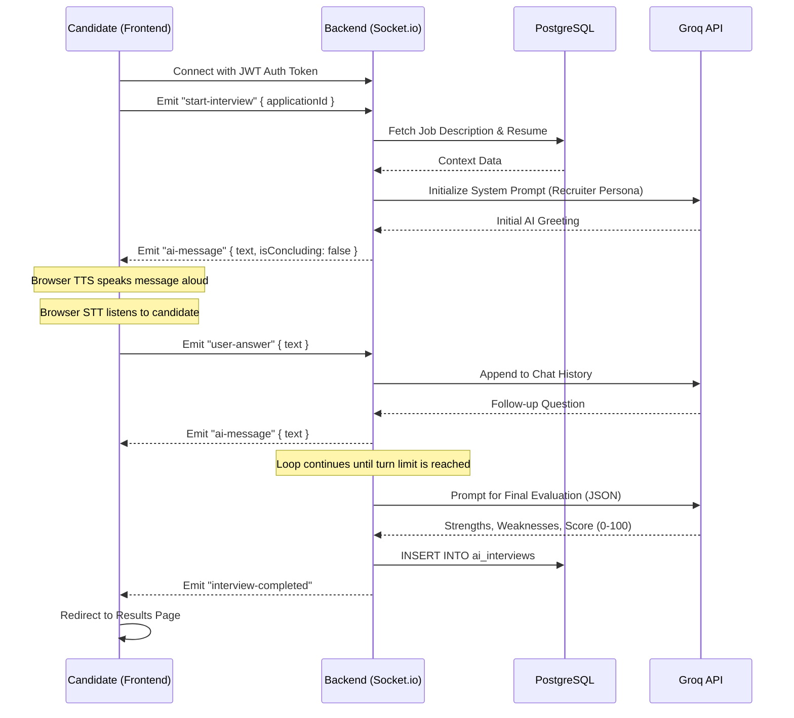

# AI Conversational Interviewer - Architecture & Integration Guide

This document outlines the architecture, data flow, and integration details of the AI Conversational Interviewer feature. It is designed to help explain the system architecture during technical interviews or team onboardings.

---

## 1. High-Level Architecture

The system enables a real-time, bidirectional voice interview between a candidate and an AI Recruiter (powered by Groq/Llama-3). It bypasses the need for expensive third-party Speech-to-Text (STT) and Text-to-Speech (TTS) services by leveraging the browser's native **Web Speech APIs**.

```mermaid
graph TD
    subgraph Frontend Client (Next.js / React)
        A[Candidate Microphone] -->|SpeechRecognition API| B(Transcribed Text)
        E(AI Text Response) -->|SpeechSynthesis API| F[Candidate Speakers]
        B -->|WebSocket: 'user-answer'| C{Socket.IO Client}
        C -->|WebSocket: 'ai-message'| E
    end

    subgraph Backend Server (Node.js / Express)
        C <==>|Namespace: /ai-interview| D{Socket.IO Server}
        D -->|System Prompt + Context| G[Groq API / Llama-3]
        G -->|Streaming/Completion| D
        D -->|SQL: Save Transcript & Score| H[(PostgreSQL DB)]
    end

    subgraph Recruiter Dashboard
        I[Recruiter UI] -->|GET /api/ai/interview/result| J[Express REST API]
        J -->|Fetch Results| H
    end
```

---

## 2. Real-Time Socket Lifecycle (Data Flow)

The core interview loop operates over a stateful WebSocket connection. 

### Sequence Diagram



---

## 3. Frontend Integration

### Web Speech API Usage
The frontend (`AiInterview.tsx`) relies on standard web APIs, significantly reducing latency and operational costs.

- **Speech-to-Text (STT):** Uses `window.SpeechRecognition` (or `webkitSpeechRecognition`).
  - *How it works:* The microphone captures audio, transcribes it locally (or via browser's built-in cloud service), and returns text. When the user finishes a sentence (`isFinal`), the text is emitted to the socket.
- **Text-to-Speech (TTS):** Uses `window.speechSynthesis`.
  - *How it works:* When an `ai-message` is received via socket, a `SpeechSynthesisUtterance` is created and spoken using high-quality voices (e.g., Google US English).

### UI State Machine
The visual "pulsing orb" is driven by a simple state machine:
- `connecting`: Establishing socket connection.
- `ai-speaking`: TTS is currently playing.
- `listening`: Mic is active, capturing user voice.
- `processing`: Waiting for the LLM response.

---

## 4. Backend Integration

### Socket Handling (`src/socket/ai-interview.ts`)
- **Authentication**: Middleware verifies the JWT token before allowing connection.
- **Context Gathering**: Upon `start-interview`, the backend performs SQL queries to gather:
  1. The Job Description (`jobs` table).
  2. The Candidate's parsed resume (`resumes` or `applications` table).
- **Prompt Engineering**: The backend constructs a rigid system prompt, instructing the Groq LLM to act as a technical recruiter, keep responses brief (conversational), and ask one question at a time.

### Automated Evaluation
Once the interview concludes (e.g., after 5 conversational turns), the backend appends a hidden system prompt to the transcript:
> *"Analyze the interview. Output ONLY valid JSON containing strengths, weaknesses, feedback, and a score."*

This JSON is parsed and stored securely in the PostgreSQL `ai_interviews` table.

### Schema Design
```sql
CREATE TABLE ai_interviews (
  id SERIAL PRIMARY KEY,
  application_id INT UNIQUE REFERENCES applications(application_id),
  transcript JSONB NOT NULL,
  evaluation JSONB NOT NULL,
  score INT NOT NULL,
  created_at TIMESTAMP DEFAULT CURRENT_TIMESTAMP
);
```

---

## 5. Talking Points for Interviews

If you are asked to explain this feature during a system design or technical interview, highlight these engineering decisions:

1. **Why WebSockets over HTTP?**
   - HTTP requires opening a new connection for every message. WebSockets maintain a persistent, bidirectional connection, drastically reducing latency which is critical for a natural voice conversation.
2. **Why Native Browser Speech APIs?**
   - Cost efficiency and speed. Using external APIs (like Deepgram or OpenAI Whisper/TTS) requires streaming raw audio buffers over the network, incurring high compute costs and network latency. Native APIs offload processing to the client's browser/OS.
3. **Handling AI Hallucinations:**
   - The Groq LLM is strictly prompted to output JSON during the evaluation phase. The backend implements `try/catch` JSON parsing with fallback defaults (score: 0) to ensure the system doesn't crash if the LLM outputs malformed data.
4. **Database Concurrency:**
   - The evaluation saving mechanism uses `ON CONFLICT (application_id) DO UPDATE` (an UPSERT) to ensure that if an interview is somehow restarted or network issues occur, duplicate records aren't created for a single application.
